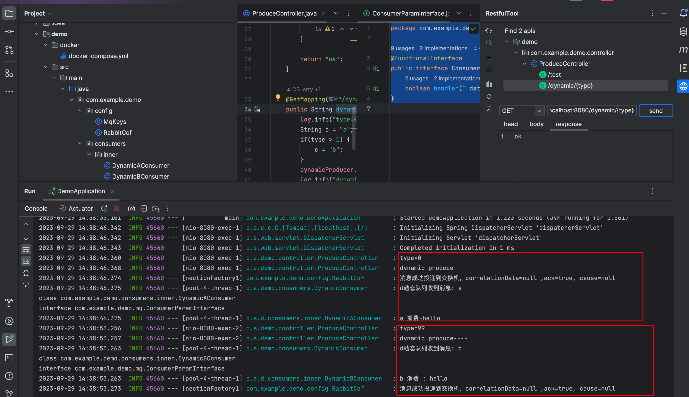

# [中间件] Java中间件大师揭秘：RabbitMQ + MySQL 异步任务，一个队列实现多种任务消费

> 前言： 在软件开发中，我们经常面临处理多种异步任务的挑战。当任务类型不断增加时，管理多个队列和消费者变得复杂而繁琐。然而，通过将多种任务类型放入同一个队列中进行消费，我们可以获得一系列重要的好处。本文将深入探讨为什么要通过一个队列实现多种任务消费，并揭示其中的优势。

---
[TOC]

---

## 为什么

使用一个队列实现多种任务消费，只使用一个 RabbitMQ 交换机和一个队列的主要原因是简化系统架构和管理复杂性。以下是一些适用于这种场景的应用例子：

### 1. 日志收集和处理
使用一个队列作为中心日志收集器，各个日志产生者将日志消息发送到该队列，并由消费者进行处理和存储。这样可以集中管理和处理所有的日志消息，而无需为每个产生者创建单独的队列和交换机。

### 2. 任务分发和处理
使用一个队列作为任务分发中心，各个任务生产者将任务消息发送到该队列，并由消费者进行任务处理。消费者可以根据消息中的标识或其他属性来区分不同类型的任务，并进行相应的处理操作。

### 3. 事件驱动架构
使用一个队列作为事件总线，在系统中各个模块之间传递事件消息。不同的模块可以将事件消息发送到同一个队列，并通过消费者来处理这些事件。这种架构可以实现解耦和灵活性，使得系统的不同部分可以独立演化和扩展。

### 4. 系统监控和警报
使用一个队列接收系统监控数据，并由消费者对数据进行分析和处理。例如，收集服务器的性能指标、错误日志等信息，并通过消费者进行实时监控和触发警报。

### 5. 数据同步和复制
使用一个队列作为数据同步的中心，将数据更新操作发送到队列中，并由消费者进行数据的复制和同步。这种方式可以保证数据的一致性和可靠性，并简化数据同步的管理和部署。

## 怎么办

### 1. 标准化

为了实现消息的动态消费，我们的生产者以及消费者进行简单封装达到一个标准化，通常可以方便后续进行异构处理。

* 生产者抽象父类

```java
public abstract class BaseProducer<T>{

    private String exchange;
    private String routingKey;

    @Resource
    private RabbitTemplate rabbitTemplate;

    public void init(String e, String r) {
        exchange = e;
        routingKey = r;
    }

    private void check() {
        if(Objects.isNull(exchange) || Objects.isNull(routingKey)) {
            throw new RuntimeException("please init BaseProducer first");
        }
    }
    public void sendMessage(T message) {
        check();
        rabbitTemplate.convertAndSend(exchange, routingKey, message);
    }
}

```

* 消费处理参数化

```java
@FunctionalInterface
public interface ConsumerParamInterface<T> {
    boolean handler(T data) throws InterruptedException;
}

```

* 消费者抽象父类

```java
@Slf4j
@Component
public abstract class BaseConsumer<T> {

    private ExecutorService executorService;

    @PostConstruct
    public void init() {
        executorService = new ThreadPoolExecutor(
                0,
                10,
                60L,
                TimeUnit.SECONDS,
                new SynchronousQueue<>());
    }

    public void handleMessage(T data, Message message, Channel channel, ConsumerParamInterface<T> consume) throws IOException, ExecutionException, InterruptedException {
      
        executorService.submit(() -> {
            int retryCount = 3;
            long deliveryTag = message.getMessageProperties().getDeliveryTag();
            while (retryCount-- > 0) {
                try {
                    // 处理消息
                    boolean handler = consume.handler(data);
                    if (handler) {
                        channel.basicAck(deliveryTag, false);
                        return;
                    }
                } catch (Exception e) {
                    log.error("程序异常：{}", e.getMessage());
                }
            }
            try {
                channel.basicNack(deliveryTag, false, false);
            } catch (IOException e) {
                throw new RuntimeException(e);
            }
        });
    }

}

```

* 反射获取消息处理函数进行动态消费

```java
@Component
@Slf4j
public class BaseConsumerUtil {

    public boolean invokeByClassName(String name) {
        try {
            Class<?> targetClass = Class.forName(name);
            Class<?> targetInterface = ConsumerParamInterface.class;
            if (targetInterface.isAssignableFrom(targetClass)) {
                ConsumerParamInterface instance = (ConsumerParamInterface<?>)targetClass.getDeclaredConstructor().newInstance();
                return instance.handler("hello");
            } else {
                log.error("{} does not implement the interface.", targetClass);
            }
        } catch (ClassNotFoundException e) {
            log.error("Class or interface not found."+e.getMessage());
        } catch (Exception e) {
            log.error("Error: " + e.getMessage());
        }
        return false;
    }

}

```


### 2. 动态消费实践

* 生产者

```java
@Component
public class DynamicProducer extends BaseProducer<String> {

    @Resource
    private MqKeys mqKey;

    public void sendMessage(String message) {
        super.init(mqKey.NORMAL_EXCHANGE, mqKey.DYNAMIC_ROUTING_KEY);
        super.sendMessage(message);
    }
}
```


* 消费者

```java
public class DynamicConsumer extends BaseConsumer<String> {

    @Resource
    private BaseConsumerUtil baseConsumerUtil;

    private final static HashMap<String, String> clz = new HashMap<String, String>(){{
        put("a", DynamicAConsumer.class.getName());
        put("b", DynamicBConsumer.class.getName());
    }};

    @RabbitHandler
    public void handleMessage(String data, Message message, Channel channel) throws IOException, ExecutionException, InterruptedException {
        handleMessage(data, message, channel, d->{
            String s = clz.getOrDefault(d,"");
            log.info("d动态队列收到消息: {}", data);
            return baseConsumerUtil.invokeByClassName(s);
        });
    }
}
```

* A 类消费

```java
@Slf4j
public class DynamicAConsumer implements ConsumerParamInterface<String> {

    @Override
    public boolean handler(String data) throws InterruptedException {
        log.info("a 消费-{}", data);
        return true;
    }
}
```

* B 类消费

```java
@Slf4j
public class DynamicBConsumer implements ConsumerParamInterface<String> {

    @Override
    public boolean handler(String data) throws InterruptedException {
        log.info("b 消费 : {}", data);
        return true;
    }
}
```

* 消息入口

```java
@RestController
@Slf4j
public class ProduceController {

    @Resource
    private Producer producer;

    @Resource
    private DynamicProducer dynamicProducer;


    @GetMapping("/dynamic/{type}")
    public String dynamic(@PathVariable(value = "type") Integer type) throws InterruptedException {
        log.info("type={}",type);
        String c = "a";
        if(type > 1) {
            c = "b";
        }
        dynamicProducer.sendMessage(c);
        log.info("dynamic produce----");
        return "ok";
    }

}

```

### 3. 测试结果




## 参考连接

* [rabbit 官网][Dead Letter Exchanges — RabbitMQ](https://www.rabbitmq.com/dlx.html)

* [V2具体代码仓库](https://github.com/csDeng/easy_rabbitmq/tree/master)

